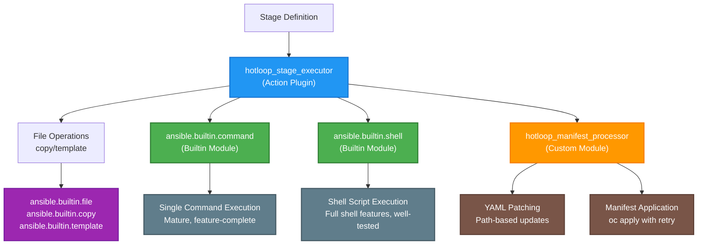

# hotloop - ansible role

Implements a simple "stages" loop, to run commands, apply kubernetes manifests
and run wait conditions.

The "stages" are driven by automation vars, examples is available in the
scenarios repository, see [automation-vars.yml](
  scenarios/uni01alpha/automation-vars.yml).

Scenarios also contain a [manifests](scenarios/uni01alpha/manifests/)
directory with CRs that will be applied in the order defined in automation
vars.

Schema for a stage item is:

* `name`: (string) A name for the stage, used in task names for UI purpose
  only.
* `documentation`: (string) A multi-line string providing a explanation of
  what the stage does.
* `command`: (string) A command to run for the stage.
* `shell`: (string) A shell script to run for the stage.
  * If commands or shell commands must run after applying manifests, use a
    separate stage or place the commands in `wait_conditions`.
* `manifest`: (string) Path to a static or templated manifest file to apply to
  the cluster. If the file has a `.j2` extension, it will be treated as a
  Jinja2 template and rendered before applying.
  For templated manifests, the template is rendered first, then patches are
  applied.
* `patches`: (list) List of YAML patches to apply to `manifests`.
  * Each patch must define the `path` and the `value` to replace at the path.
    * `path`: The location in the YAML data for replacement.
    * `value`: The new value to replace the existing one.
  * A patch can optionally include a list of `where` conditions.
    * Each `where` condition requires:
      * `path`: The specific location within the YAML data to evaluate.
      * `value`: The value to compare against at the specified path.
  * Jinja2 manifests are templated first, then patches are applied.
  * The `value` replaces the current value, no merge.
  * Patches apply to all YAML documents in the file with the specified path.
  * An error is raised if no YAML document in the file has the specified path.

  **Example patch:**

    ```yaml
    patches:
      - path: "spec.dns.template.options.[0].values"
        value:
          - 192.168.32.250
          - 192.168.32.251
        where:
          - path: kind
            value: OpenStackControlPlane
          - path: metadata.namespace
            value: openstack-b
    ```

* `wait_conditions` (list) A list of commands to run after applying the
  manifest, i.e `oc wait --for <condition>`
* `run_conditions` (list) A list of conditions that must be met for a stage
  to execute. Strings `False`, `FALSE` and `false` will be evaluated as
  `False`, otherwise the python boolean equivalent of the value.

  The condition field can use Jinja2 syntax, which allows for dynamic
  evaluation of expressions based on the available variables in the automation
  environment. The curly brackets `{{ }}` denote Jinja2 template expressions.

  **Example stage run conditions**:

    ```yaml
    run_conditions:
      - "{{ foo is defined }}"
      - >-
        {{
          openstack_operators_starting_csv | default(none) is none or
          openstack_operators_starting_csv is version('v1.0.0', '<') or
          openstack_operators_starting_csv is version('v1.0.6', '>')
        }}
    ```

* `stages`: (dict, list or YAML string) Nested stages, enable referencing
  stages inline or loading stages from different files by utilizing ansible
  `lookup()`.

  By setting `run_conditions` on a stage with nested stages it is also
  possible to conditionally include/exclude stages.

  > **NOTE**: Nested stages are not allowed to have their own nested stages.

  **Example stage including nested stages**:

  ```yaml
  - name: Include stages from template
    stages: >-
      {{
        lookup('ansible.builtin.template', 'extra_stages.yaml.j2')
      }}
    run_conditions:
      - "{{ extra_stages is defined and extra_stages }}"
  ```

> **_NOTE_**: Stage items are applied the actions in the following order:
> `command` -> `shell` -> `manifest` -> `wait_conditions` -> `stages`.

Example:

```yaml
---
stages:
  - name: Node label cinder-lvm
    documentation: |
      The LVM backend for Cinder is a special case as the storage data is on
      the OpenShift node and has no external storage systems. This has several
      implications

      * To prevent issues with exported volumes, cinder-operator automatically
        uses the host network. The backend is configured to use the host's
        VLAN IP address. This means that the cinder-volume service doesn't
        need any networkAttachments.
      * There can only be one node with the label openstack.org/cinder-lvm=.
        Apply the label using the command::
          ``oc label node <nodename> openstack.org/cinder-lvm=``
    command: "oc label node master-0 openstack.org/cinder-lvm="

  - name: Common OLM
    documentation: |
      Install the OpenStack K8S operators and their dependencies. (Namespaces,
      OperatorGroup, and Subscription CRs.)

      Once these CRs are created, run the `oc wait` commands to confirm that
      each step of this procedure is complete.
    manifest: ../common/olm.yaml.j2
    wait_conditions:
      - "oc wait namespaces metallb-system --for jsonpath='{.status.phase}'=Active --timeout=300s"
      - "oc wait namespaces openshift-nmstate --for jsonpath='{.status.phase}'=Active --timeout=300s"
      - "oc wait namespaces openstack-operators --for jsonpath='{.status.phase}'=Active --timeout=300s"
      - "oc wait namespaces openstack --for jsonpath='{.status.phase}'=Active --timeout=300s"
      - "oc wait -n cert-manager-operator pod --for condition=Ready -l name=cert-manager-operator --timeout=300s"
      - "oc wait -n cert-manager pod -l app=cainjector --for condition=Ready --timeout=300s"
      - "oc wait -n cert-manager pod -l app=webhook --for condition=Ready --timeout=300s"
      - "oc wait -n cert-manager pod -l app=cert-manager --for condition=Ready --timeout=300s"
      - "oc wait -n metallb-system pod -l control-plane=controller-manager --for condition=Ready --timeout=300s"
      - "oc wait -n metallb-system pod -l component=webhook-server --for condition=Ready --timeout=300s"
      - "oc wait -n openshift-nmstate deployments/nmstate-operator --for condition=Available --timeout=300s"
      - "oc wait -n openstack-operators -l openstack.org/operator-name deployment --for condition=Available --timeout=300s"
      - "oc wait -n openstack-operators -l app.kubernetes.io/name=rabbitmq-cluster-operator deployment --for condition=Available --timeout=300s"
      - "oc wait -n openstack-operators -l app.kubernetes.io/instance=webhook-service service --for jsonpath='{.status.loadBalancer}' --timeout=300s"

  - name: Common MetalLB
    manifest: ../common/metallb.yaml
    wait_conditions:
      - "oc wait pod -n metallb-system -l component=speaker --for condition=Ready --timeout=300s"

  - name: Common NMState
    manifest: ../common/nmstate.yaml
    wait_conditions:
      - "oc wait pod -n openshift-nmstate -l component=kubernetes-nmstate-handler --for condition=Ready --timeout=300s"
      - "oc wait deployments/nmstate-webhook -n openshift-nmstate --for condition=Available --timeout=300s"

  - name: NodeNetworkConfigurationPolicy (nncp)
    manifest: manifests/control-plane/nncp/nncp.yaml
    wait_conditions:
      - >-
        oc -n openstack wait nncp
        -l osp/nncm-config-type=standard
        --for jsonpath='{.status.conditions[0].reason}'=SuccessfullyConfigured
        --timeout=5m

  - name: Dataplane SSH key secret
    command: >-
      oc create -n openstack secret generic dataplane-ansible-ssh-private-key-secret
      --save-config --dry-run=client
      --from-file=ssh-privatekey=/home/zuul/.ssh/id_rsa
      --from-file=ssh-publickey=/home/zuul/.ssh/id_rsa.pub
      --type=Opaque -o yaml | oc apply -f -
    wait_conditions:
      - >-
        oc wait -n openstack secret dataplane-ansible-ssh-private-key-secret
        --for jsonpath='{.metadata.name}'=dataplane-ansible-ssh-private-key-secret
        --timeout=30s

  - name: Nova migration SSH key secret
    command: >-
      oc create -n openstack secret generic nova-migration-ssh-key
      --save-config --dry-run=client
      --from-file=ssh-privatekey=/home/zuul/.ssh/id_nova_migrate
      --from-file=ssh-publickey=/home/zuul/.ssh/id_nova_migrate.pub
      --type=Opaque -o yaml | oc apply -f -
    wait_conditions:
      - >-
        oc wait -n openstack secret nova-migration-ssh-key
        --for jsonpath='{.metadata.name}'=nova-migration-ssh-key
        --timeout=30s
```

## Example playbook

```yaml
- name: Deploy RHOSO
  hosts: localhost
  gather_facts: true
  strategy: linear
  pre_tasks:
    - name: Load stack outputs from file
      ansible.builtin.include_vars:
        file: "{{ stack_name }}-outputs.yaml"
        name: stack_outputs

    - name: Add controller-0 to the Ansible inventory
      ansible.builtin.add_host: "{{ stack_outputs.controller_ansible_host }}"

    - name: Load dataplane SSH keys vars
      ansible.builtin.include_vars:
        file: dataplane_ssh_keys_vars.yaml

    - name: "Load automation vars and store in variable: automation"
      ansible.builtin.include_vars:
        file: "{{ automation_vars_file }}"
        name: automation

  roles:
    - role: hotloop
      delegate_to: controller-0
      vars:
        work_dir: "{{ scenario_dir }}/{{ scenario }}"
```

## Architecture

The hotloop role uses a modular architecture with specialized components that
work together to execute stages efficiently while providing clean, non-verbose
Ansible output.

### Design Overview

The system consists of **1 orchestrating action plugin** and **2 specialized
modules**, plus leveraging Ansible's proven builtin modules:



### Components

#### 1. Action Plugin (`hotloop_stage_executor.py`)

* **Role**: Orchestrator that runs on the Ansible controller
* **Responsibilities**:
  * Handles file operations (copy/template) for manifests
  * Detects stage types and calls appropriate modules
  * Aggregates results from all modules into a unified response
  * Uses fully qualified collection names (`ansible.builtin.*`)

#### 2. Command Execution (`ansible.builtin.command`)

* **Role**: Executes single commands using proven Ansible builtin
* **Responsibilities**:
  * Handles `command` stage types
  * Provides mature, well-tested command execution
  * Supports all standard features (chdir, creates, removes, environment,
    etc.)

#### 3. Shell Execution (`ansible.builtin.shell`)

* **Role**: Executes shell scripts using proven Ansible builtin
* **Responsibilities**:
  * Handles `shell` stage types
  * Provides full shell features with robust error handling
  * Supports pipes, redirections, complex shell constructs

#### 4. Manifest Processor (`hotloop_manifest_processor.py`)

* **Role**: Processes Kubernetes manifests
* **Responsibilities**:
  * Handles `manifest` stage types (static and templated)
  * Applies YAML patches using path-based updates
  * Applies manifests to cluster with retry logic for transient errors
  * Manages backup files for change detection

#### 5. Wait Condition Handler (`hotloop_wait_condition.py`)

* **Role**: Handles wait conditions separately
* **Responsibilities**:
  * Executes wait commands with built-in retry logic
  * Provides visibility by running as separate Ansible tasks
  * Handles transient Kubernetes/OpenShift errors

### Execution Flow

1. **Stage Processing**: The action plugin examines each stage definition
2. **File Operations**: For manifest stages, files are copied or templated
   from controller to target
3. **Module Orchestration**: Based on stage contents, the action plugin calls:
   * `ansible.builtin.command` if `command` is present
   * `ansible.builtin.shell` if `shell` is present
   * `hotloop_manifest_processor` if `manifest` is present
4. **Wait Conditions**: Handled separately as visible Ansible tasks
5. **Result Aggregation**: All module results are combined into a unified
   response

### Benefits

* **Single Responsibility**: Each component has one clear, focused purpose
* **Proven Modules**: Leverages mature, well-tested Ansible builtin modules
  for command/shell execution
* **Feature Complete**: Command and shell execution includes all standard
  Ansible features
* **Easier Testing**: Custom modules can be tested in isolation; builtin
  modules are already proven
* **Better Maintainability**: Less custom code to maintain, changes to one
  aspect don't affect others
* **Clean Output**: Eliminates skipped tasks and verbose conditional logic
* **Extensibility**: Adding new stage types requires only creating new modules
  or using existing ones
* **Security**: Builtin modules have been thoroughly vetted for security
  issues
* **Familiar Behavior**: Command and shell execution behaves exactly as users
  expect from Ansible

### Template Detection

The system automatically detects Jinja2 templating based on file extensions:

* Files ending in `.j2` are treated as templates and processed accordingly
* Static files are copied directly without templating
* This eliminates the need for separate `j2_manifest` configuration

### Task Simplicity

Despite the complex modular architecture, the user interface remains simple:

* **2 tasks per stage**: Main execution + wait conditions (if present)
* **Clean output**: No skipped tasks or verbose conditional logic
* **Unified results**: All module outputs are aggregated transparently

This architecture provides maximum modularity and maintainability while
delivering a clean, simple experience for users.
