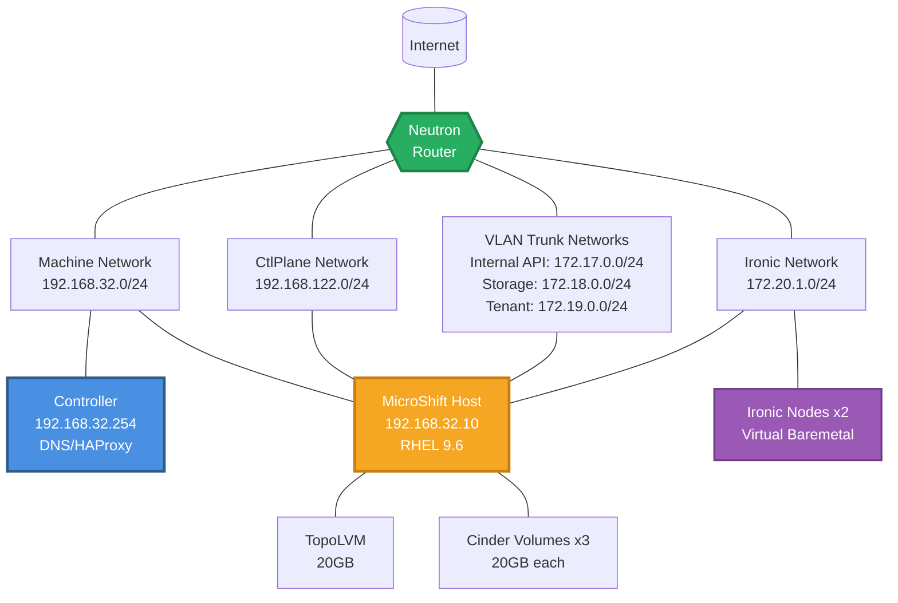

# microshift-2-bm Scenario

## Overview

A MicroShift scenario designed to test OpenStack Ironic bare metal provisioning
with 2 dedicated Ironic nodes. This scenario validates the complete OpenStack
bare metal lifecycle including node enrollment, provisioning, and comprehensive
Tempest testing using MicroShift instead of a full OpenShift cluster.

## Architecture

<!-- markdownlint-disable MD013 -->

<!-- markdownlint-enable MD013 -->

### Component Details

- **Controller**: Hotstack controller providing DNS, load balancing, and
  orchestration services
- **MicroShift Host**: RHEL 9.6 host running MicroShift with the complete
  OpenStack control plane
- **Ironic Nodes**: 2 virtual bare metal nodes for testing Ironic provisioning
  workflows

## Features

- MicroShift lightweight Kubernetes distribution
- OpenStack Ironic bare metal provisioning service
- Virtual BMC using sushy-tools for RedFish emulation
- Comprehensive Tempest testing (scenario and API tests)
- Complete OpenStack service stack (Nova, Neutron, Glance, Swift, etc.)
- TopoLVM for local storage management
- Multi-network setup for OpenStack services
- Automatic node enrollment and lifecycle management

## Networks

- **machine-net**: 192.168.32.0/24 (MicroShift cluster network)
- **ctlplane-net**: 192.168.122.0/24 (OpenStack control plane)
- **internal-api-net**: 172.17.0.0/24 (OpenStack internal services)
- **storage-net**: 172.18.0.0/24 (Storage backend communication)
- **tenant-net**: 172.19.0.0/24 (Tenant network traffic)
- **ironic-net**: 172.20.1.0/24 (Bare metal provisioning network)

## OpenStack Services

This scenario deploys a comprehensive OpenStack environment:

### Core Services

- **Keystone**: Identity service with LoadBalancer on Internal API
- **Nova**: Compute service with Ironic driver for bare metal
- **Neutron**: Networking service with OVN backend
- **Glance**: Image service with Swift backend
- **Swift**: Object storage service
- **Placement**: Resource placement service

### Bare Metal Services

- **Ironic**: Bare metal provisioning service
- **Ironic Inspector**: Hardware inspection service
- **Ironic Neutron Agent**: Network management for bare metal

## Ironic Testing

### Node Configuration

- **2 Ironic Nodes**: Virtual instances with sushy-tools RedFish BMC
- **Flavor**: hotstack.medium (configurable)
- **Network**: Connected to dedicated Ironic provisioning network

### Test Scenarios

The scenario includes Tempest testing:

#### Scenario Tests

- Baremetal basic operations testing
- Instance lifecycle management
- Network connectivity validation
- Power management testing

#### API Tests

- Ironic API functionality validation
- Node management operations
- Port and allocation management
- Hardware inspection workflows

## Storage Configuration

- **TopoLVM**: Local volume management for OpenStack services
- **Cinder Volumes**: Additional block storage on `/dev/vdc`, `/dev/vdd`, `/dev/vde`
- **Swift Storage**: Object storage for Glance images
- **Database Storage**: Persistent storage for Galera clusters

## Differences from sno-2-bm

This scenario differs from `sno-2-bm` in the following ways:

1. **MicroShift instead of SNO**: Uses MicroShift (lightweight Kubernetes)
   instead of Single Node OpenShift
2. **RHEL 9.6 Base**: Uses `rhel-9.6-x86_64-kvm` image instead of iPXE boot
3. **No PXE Boot**: Does not require PXE boot DHCP options since MicroShift
   boots directly from RHEL image
4. **Simplified Deployment**: Lighter weight deployment suitable for testing
   and development

## Usage

```bash
# Deploy the scenario
ansible-playbook -i inventory.yml bootstrap.yml \
  -e @scenarios/microshift-2-bm/bootstrap_vars.yml \
  -e @~/cloud-secrets.yaml

# Run comprehensive tests
ansible-playbook -i inventory.yml 06-test-operator.yml \
  -e @scenarios/microshift-2-bm/bootstrap_vars.yml \
  -e @~/cloud-secrets.yaml
```

## Configuration Files

- `bootstrap_vars.yml`: Infrastructure and MicroShift configuration
- `automation-vars.yml`: Hotloop deployment stages
- `heat_template.yaml`: OpenStack infrastructure template
- `manifests/control-plane/control-plane.yaml`: OpenStack service configuration
- `test-operator/automation-vars.yml`: Comprehensive test automation
- `test-operator/tempest-tests.yml`: Tempest test specifications

This scenario provides a complete environment for validating OpenStack bare
metal provisioning capabilities in a MicroShift deployment with comprehensive
testing automation.
