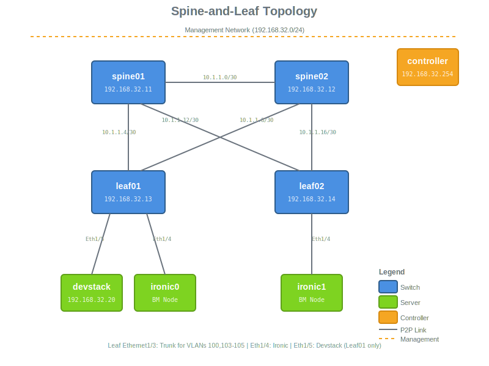

# Networking Lab: Devstack with Spine-and-Leaf VXLAN Topology

## Overview

This scenario provides a networking laboratory environment featuring a spine-and-leaf Cisco NX-OS switch topology with VXLAN overlay capabilities. The setup includes:

- **4 Cisco NX-OS switches** in a spine-and-leaf topology
  - 2 Spine switches: `spine01` and `spine02`
  - 2 Leaf switches: `leaf01` and `leaf02`
- **1 Devstack node** for running OpenStack development environment
- **2 Ironic nodes** for bare metal provisioning testing
- **1 Controller node** providing DNS, DHCP, and TFTP services for POAP

## Network Topology



The topology features a full-mesh spine-and-leaf design where:
- Both leaf switches connect to both spine switches (4 uplinks total per leaf)
- Spine switches are interconnected for redundancy
- Server nodes attach to leaf switches only
- All switches participate in OSPF for underlay routing
- Loopback interfaces (10.255.255.x/32) serve as VTEPs for VXLAN overlay

## Network Details

### Management Network
- **machine-net**: `192.168.32.0/24`
  - Controller: `192.168.32.254`
  - Spine01: `192.168.32.11`
  - Spine02: `192.168.32.12`
  - Leaf01: `192.168.32.13`
  - Leaf02: `192.168.32.14`
  - Devstack: `192.168.32.20`

### Inter-Switch Links (Underlay)
All point-to-point links are allocated from `10.1.1.0/24` to preserve `10.1.2.0/24`, `10.1.3.0/24`, etc. for other uses:
- **spine-link-net**: `10.1.1.0/30` - Link between Spine01 and Spine02
- **leaf01-spine01-net**: `10.1.1.4/30` - Link between Leaf01 and Spine01
- **leaf01-spine02-net**: `10.1.1.8/30` - Link between Leaf01 and Spine02
- **leaf02-spine01-net**: `10.1.1.12/30` - Link between Leaf02 and Spine01
- **leaf02-spine02-net**: `10.1.1.16/30` - Link between Leaf02 and Spine02

### Loopback Addresses (VTEP)
- Spine01: `10.255.255.1/32`
- Spine02: `10.255.255.2/32`
- Leaf01: `10.255.255.3/32`
- Leaf02: `10.255.255.4/32`

### BGP EVPN Topology

The fabric uses BGP EVPN for VXLAN overlay control plane with the following iBGP configuration:

```
         spine01 (RR)          spine02 (RR)
         10.255.255.1          10.255.255.2
              |    |                |    |
              |    +-------+--------+    |
              |            |             |
           iBGP         iBGP          iBGP
              |            |             |
         +----+            +----+--------+
         |                      |
    leaf01 (RRC)           leaf02 (RRC)
    10.255.255.3           10.255.255.4
    NVE1 (VTEP)            NVE1 (VTEP)
```

**Configuration Details:**
- **AS Number**: 65001 (iBGP)
- **Route Reflectors**: spine01 and spine02 serve as BGP route reflectors
- **Route Reflector Clients**: leaf01 and leaf02 are route reflector clients
- **Address Family**: L2VPN EVPN
- **VTEP Interfaces**: NVE1 on each leaf switch (source-interface loopback0)
- **Host Reachability**: BGP-based VXLAN (ingress-replication via BGP)

This configuration allows the ML2 networking-generic-switch plugin to dynamically create VNIs and map VLANs to VXLANs across the fabric.

### Networks

**Bridge Networks** (Simple L2 connectivity for servers):
- `devstack-br-net` (`172.20.10.0/29`): Devstack ↔ Leaf01 (Ethernet1/5)
- `ironic0-br-net` (`172.20.11.0/29`): Ironic0 ↔ Leaf01 (Ethernet1/4)
- `ironic1-br-net` (`172.20.12.0/29`): Ironic1 ↔ Leaf02 (Ethernet1/4)

**Leaf01 Tenant VLANs** (on trunk port Ethernet1/3):
- `leaf01-trunk-net` (`172.20.20.0/24`): Parent/native VLAN
- `leaf01-public-vlan100` (`172.20.0.0/24`): VLAN 100 - Public network
- `leaf01-tenant-vlan103` (`172.20.3.0/24`): VLAN 103 - Tenant network
- `leaf01-tenant-vlan104` (`172.20.4.0/24`): VLAN 104 - Tenant network
- `leaf01-tenant-vlan105` (`172.20.5.0/24`): VLAN 105 - Tenant network

**Leaf02 Tenant VLANs** (on trunk port Ethernet1/3):
- `leaf02-trunk-net` (`172.20.21.0/24`): Parent/native VLAN
- `leaf02-public-vlan100` (`172.20.1.0/24`): VLAN 100 - Public network
- `leaf02-tenant-vlan103` (`172.20.6.0/24`): VLAN 103 - Tenant network
- `leaf02-tenant-vlan104` (`172.20.7.0/24`): VLAN 104 - Tenant network
- `leaf02-tenant-vlan105` (`172.20.8.0/24`): VLAN 105 - Tenant network

> **Note**: Leaf switches receive these as Neutron provider networks via trunk ports. ML2 plugins can dynamically manage VLAN configurations on edge ports.

## Switch Configuration

### Spine Switches (Spine01 & Spine02)
The spine switches are configured with:
- OSPF for underlay routing (Area 0.0.0.0)
- BGP AS 65001 configured as route reflectors for L2VPN EVPN
- NV overlay features enabled
- Point-to-point links to all leaf switches
- iBGP neighbors to both leaf switches

### Leaf Switches (Leaf01 & Leaf02)
The leaf switches are configured with:
- OSPF for underlay routing (Area 0.0.0.0)
- BGP AS 65001 as route reflector clients for L2VPN EVPN
- NVE1 interface configured for VXLAN (source-interface loopback0)
- VN-segment-vlan-based feature enabled
- **Minimal base configuration** - VLANs, VNIs, and port configurations managed dynamically via ML2 plugins
- Edge ports (Ethernet1/3, 1/4, 1/5) shutdown by default - to be configured by networking-generic-switch ML2 plugin
- Port assignments:
  - **Leaf01**: Ethernet1/3 (trunk for VXLAN VNIs), Ethernet1/4 (Ironic0), Ethernet1/5 (Devstack)
  - **Leaf02**: Ethernet1/3 (trunk for VXLAN VNIs), Ethernet1/4 (Ironic1)

## POAP Configuration

Each switch receives a unique configuration via POAP (Power-On Auto Provisioning):

| Switch  | MAC Address       | IP Address     | POAP Script        | POAP Config File    | Role  |
|---------|-------------------|----------------|--------------------|--------------------|-------|
| spine01 | 22:57:f8:dd:01:01 | 192.168.32.11  | spine01-poap.py    | spine01-poap.cfg   | Spine |
| spine02 | 22:57:f8:dd:02:01 | 192.168.32.12  | spine02-poap.py    | spine02-poap.cfg   | Spine |
| leaf01  | 22:57:f8:dd:03:01 | 192.168.32.13  | leaf01-poap.py     | leaf01-poap.cfg    | Leaf  |
| leaf02  | 22:57:f8:dd:04:01 | 192.168.32.14  | leaf02-poap.py     | leaf02-poap.cfg    | Leaf  |

The POAP process uses DHCP options:
- Option 66 (TFTP Server): Points to controller IP (192.168.32.254)
- Option 67 (Boot File): Points to switch-specific Python script (e.g., `core01-poap.py`)

Each switch has its own POAP script that points to its specific configuration file. The POAP script downloads and applies the configuration, then installs the NX-OS image.

## Components

### Controller Node
The controller provides:
- **DNS** (dnsmasq): Name resolution for all nodes
- **DHCP** (dnsmasq): IP address assignment with POAP options
- **TFTP** (dnsmasq): POAP script and configuration file distribution
- **HTTP** (httpd on port 8081): Additional file serving

### Devstack Node
OpenStack development environment with two network interfaces:
- **eth0**: Management network (192.168.32.20)
- **eth1**: Trunk port with VLANs 100, 103, 104, 105 (to Leaf01 Ethernet1/5)
  - Native VLAN: devstack-br-net
  - VLAN 100: leaf01-public-vlan100
  - VLAN 103: leaf01-tenant-vlan103
  - VLAN 104: leaf01-tenant-vlan104
  - VLAN 105: leaf01-tenant-vlan105

### Ironic Nodes
Bare metal nodes for provisioning testing:
- **ironic0**: Attached to Leaf01 (Ethernet1/4) via ironic0-br-net
- **ironic1**: Attached to Leaf02 (Ethernet1/4) via ironic1-br-net
- Managed via Redfish virtual BMC (sushy-tools)
- Configured for UEFI boot mode

## Deployment

### Prerequisites
1. OpenStack cloud with Heat support
2. Required images uploaded:
   - `hotstack-controller`
   - `nexus9300v.9.3.15` (or your NX-OS version)
   - `CentOS-Stream-GenericCloud-9`
   - `sushy-tools-blank-image`
3. SSH key pair configured
4. Sufficient quota for:
   - 7 instances (1 controller + 4 switches + 1 devstack + 1 ironic)
   - Multiple networks and subnets
   - Floating IP

### Deploy the Stack

1. Update variables in `bootstrap_vars.yml`:
```yaml
os_cloud: your-cloud-name
controller_ssh_pub_key: "{{ lookup('file', '~/.ssh/id_rsa.pub') }}"
dataplane_ssh_pub_key: "{{ lookup('file', '~/.ssh/id_rsa.pub') }}"
```

2. Deploy the infrastructure:
```bash
ansible-playbook -e @scenarios/networking-lab/devstack-nxsw-vxlan/bootstrap_vars.yml 01-infra.yml
```

3. Bootstrap the controller:
```bash
ansible-playbook -e @scenarios/networking-lab/devstack-nxsw-vxlan/bootstrap_vars.yml 02-bootstrap_controller.yml
```

4. Wait for switches to complete POAP (~10-15 minutes)

5. Verify switch connectivity:
```bash
# SSH to controller
ssh zuul@<controller-floating-ip>

# From controller, SSH to each switch
ssh admin@192.168.32.11  # spine01
ssh admin@192.168.32.12  # spine02
ssh admin@192.168.32.13  # leaf01
ssh admin@192.168.32.14  # leaf02
```

6. Install DevStack:
```bash
ansible-playbook -e @scenarios/networking-lab/devstack-nxsw-vxlan/bootstrap_vars.yml 04-install_devstack.yml
```

This will:
- Configure the DevStack node with proper networking
- Run stack.sh to install OpenStack with OVN, Ironic, and networking-generic-switch
- Configure networking-generic-switch with leaf switch credentials
- Set up neutron networks and bridge mappings
- Create clouds.yaml on the controller for remote DevStack access

7. Enroll Ironic nodes (optional, for testing baremetal provisioning):
```bash
ansible-playbook -e @scenarios/networking-lab/devstack-nxsw-vxlan/bootstrap_vars.yml 05-hotloop-stages.yml
```

This will:
- Enroll the Ironic nodes in DevStack's Ironic service using definitions from Heat stack outputs
- Wait for nodes to reach 'enroll' state (validates BMC connectivity)
- Transition nodes to 'manageable' state (prepares for provisioning operations)

The enrollment creates:
- Ironic nodes with Redfish BMC configuration pointing to sushy-tools instances
- Ironic ports with local_link_information for networking-generic-switch integration
- Port bindings that trigger VLAN configuration on physical switches when nodes are deployed


## Validation

### Verify Switch Underlay
```bash
# On any switch
show ip route
show ip ospf neighbors
```

### Verify BGP EVPN Overlay
```bash
# On spine switches (route reflectors)
show bgp l2vpn evpn summary

# On leaf switches
show bgp l2vpn evpn summary
show nve peers
show interface nve1
show nve vni
```

Expected output:
- **Spines**: BGP neighbors (leaf switches) should be in "Established" state
- **Leafs**: BGP neighbors (spine switches) should be in "Established" state
- **Leafs**: NVE peers will appear once VNIs are created dynamically by ML2 plugin
- **Leafs**: VNI list will populate as ML2 creates VLAN-to-VNI mappings

### Verify Switch Connectivity
```bash
# From controller
ssh admin@192.168.32.11  # spine01
ssh admin@192.168.32.12  # spine02
ssh admin@192.168.32.13  # leaf01
ssh admin@192.168.32.14  # leaf02
```

## Use Cases

This scenario is ideal for:
- **ML2 Plugin Development**: Test networking-generic-switch and other ML2 mechanism drivers
- **Dynamic Switch Configuration**: Validate automatic VLAN creation and port configuration
- **VXLAN/EVPN Testing**: Validate VXLAN overlay configurations
- **Ironic Bare Metal Testing**: Validate bare metal provisioning with network integration
- **Network Automation**: Develop and test OpenStack-driven network automation
- **Spine-Leaf Architecture**: Learn and validate spine-leaf design patterns

## Customization

### Adding More VLANs/VNIs
Edit the leaf switch POAP configs to add more VLANs:
```
vlan 200
  name Another_VLAN
  vn-segment 10200
```

### Changing Topology
Modify `heat_template.yaml` to:
- Add more spine or leaf switches
- Add more server ports
- Adjust IP addressing schemes

### BGP Configuration
BGP EVPN is pre-configured in the POAP files with:
- AS 65001 (iBGP)
- Spines as route reflectors
- Leafs as route reflector clients
- L2VPN EVPN address-family enabled

If you need to modify BGP parameters (e.g., add more neighbors or change policies), edit the POAP configuration files (`*-poap.cfg`) and redeploy the stack.

## Troubleshooting

### Switch POAP Failed
- Check DHCP options: `tail -f /var/log/messages` on controller
- Verify TFTP connectivity: `curl tftp://192.168.32.254/poap.py`
- Check switch console logs via OpenStack console

### Switches Not Reachable
- Verify management interface configuration on switches
- Check DNS resolution from controller
- Ensure routes are configured in management VRF

### Devstack Deployment Issues
- Check network connectivity on eth1
- Verify VLAN configuration on leaf switch
- Review devstack logs: `/opt/stack/logs/stack.sh.log`

## References

- [Cisco NX-OS POAP Documentation](https://www.cisco.com/c/en/us/td/docs/switches/datacenter/nexus9000/sw/poap/guide/b_poap.html)
- [OpenStack Networking-generic-switch](https://opendev.org/openstack/networking-generic-switch)
- [DevStack Documentation](https://docs.openstack.org/devstack/latest/)
- [OpenStack Ironic Documentation](https://docs.openstack.org/ironic/latest/)
- [VXLAN BGP EVPN Design Guide](https://www.cisco.com/c/en/us/products/collateral/switches/nexus-9000-series-switches/guide-c07-734107.html)
