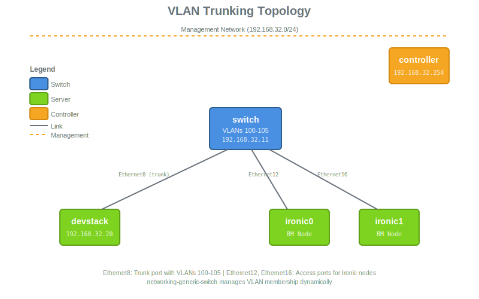

# Devstack with SONiC VLAN Trunking

VLAN-only networking lab: 1 SONiC switch, 1 Devstack, 2 Ironic nodes, 1 controller.

## Topology



Management: `192.168.32.0/24` | VLANs: 100-105 | MTU: 1500

## Deployment

Required images: `hotstack-controller`, `hotstack-sonic-vs`, `ubuntu-noble-server`, `CentOS-Stream-GenericCloud-9`

```bash
ansible-playbook -e @scenarios/networking-lab/devstack-sonic-vlan/bootstrap_vars.yml \
  -e os_cloud=<cloud> bootstrap_devstack.yml
```

## Accessing

Access the switch and devstack nodes via SSH from the controller.

```bash
# Switch
ssh admin@switch.stack.lab

# Devstack
ssh stack@devstack.stack.lab
```
