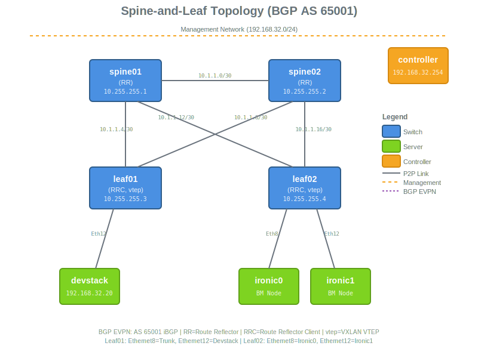

# Devstack with SONiC VXLAN Spine-and-Leaf

Spine-and-leaf topology with 4 SONiC switches, 1 Devstack node, 2 Ironic nodes, and 1 controller.

## Topology



## Networks

### Management (`192.168.32.0/24`)
- Controller: `192.168.32.254`
- Spine01 (host): `192.168.32.11`, (switch): `192.168.32.111`
- Spine02 (host): `192.168.32.12`, (switch): `192.168.32.112`
- Leaf01 (host): `192.168.32.13`, (switch): `192.168.32.113`
- Leaf02 (host): `192.168.32.14`, (switch): `192.168.32.114`
- Devstack: `192.168.32.20`

### Inter-Switch Links (`10.1.1.0/24`)
- Spine01 ↔ Spine02: `10.1.1.0/30`
- Leaf01 ↔ Spine01: `10.1.1.4/30`
- Leaf01 ↔ Spine02: `10.1.1.8/30`
- Leaf02 ↔ Spine01: `10.1.1.12/30`
- Leaf02 ↔ Spine02: `10.1.1.16/30`

### Loopback/VTEP Addresses
- Spine01: `10.255.255.1/32`
- Spine02: `10.255.255.2/32`
- Leaf01: `10.255.255.3/32` (VTEP)
- Leaf02: `10.255.255.4/32` (VTEP)

### BGP EVPN
- AS 65001 iBGP
- Spines: Route reflectors
- Leafs: Route reflector clients, vtep VTEP (source Loopback0)
- ML2 dynamically manages VLANs/VNIs

## Deployment

```bash
ansible-playbook -e @scenarios/networking-lab/devstack-sonic-vxlan/bootstrap_vars.yml -e os_cloud=<cloud-name> bootstrap_devstack.yml
```

## Troubleshooting

See [TROUBLESHOOTING.md](TROUBLESHOOTING.md).
