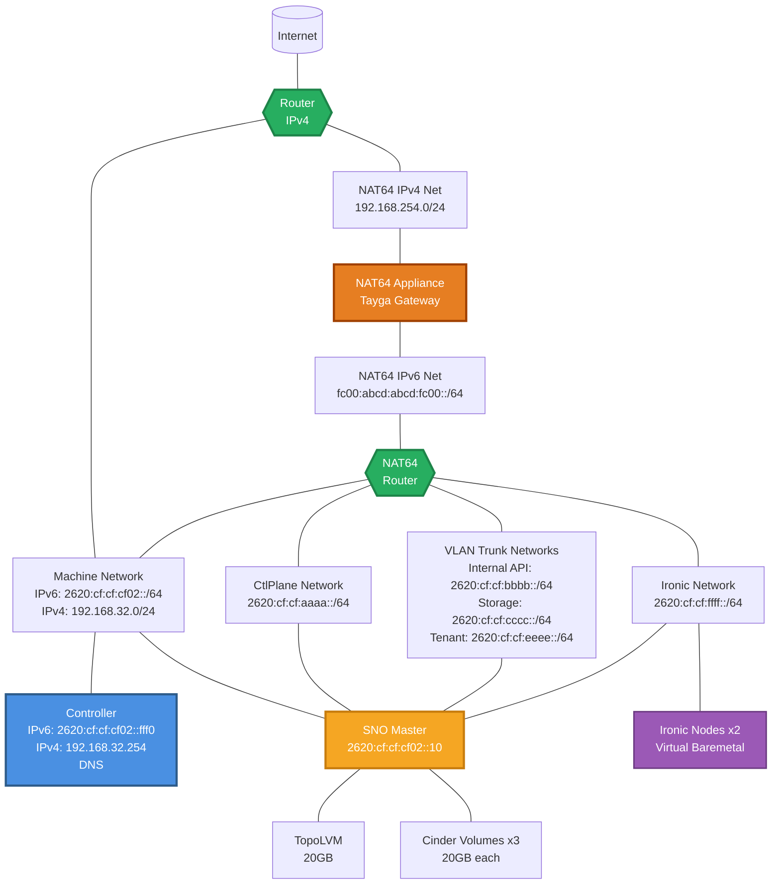

# sno-2-bm-ipv6 Scenario

## Overview

A Single Node OpenShift (SNO) IPv6 scenario designed to test OpenStack Ironic bare
metal provisioning with 2 dedicated Ironic nodes in a full IPv6 environment. This
scenario utilizes NAT64 for IPv4-to-IPv6 translation, enabling testing of OpenStack
services in an IPv6-first deployment while maintaining IPv4 compatibility through
translation.

## Architecture

<!-- markdownlint-disable MD013 -->

<!-- markdownlint-enable MD013 -->

### Component Details

- **Controller**: Hotstack controller providing DNS and HTTP services
- **SNO Master**: Single-node OpenShift cluster running complete OpenStack
  control plane (IPv6)
- **Ironic Nodes**: 2 virtual bare metal nodes for testing Ironic
  provisioning workflows
- **NAT64 Appliance**: Tayga-based NAT64/DNS64 gateway for IPv4-to-IPv6 translation
- **NAT64 Router**: Internal router handling IPv6 networks
- **IPv4 Router**: External-facing router for IPv4 connectivity and floating IPs

## Features

- **Full IPv6 Deployment**: All OpenStack services operate on IPv6 networks
- **NAT64/DNS64**: Enables IPv4 internet connectivity from IPv6-only networks
- **Dual-Stack Machine Network**: Supports both IPv4 (for PXE boot) and IPv6
- **OpenStack Ironic**: Bare metal provisioning service with IPv6 support
- **Virtual BMC**: sushy-tools for RedFish emulation
- **Comprehensive Testing**: Scenario and API validation in IPv6 environment
- **TopoLVM**: Local volume management for OpenStack services
- **Multi-network**: Dedicated IPv6 networks for different traffic types

## Networks

### IPv6 Networks

- **machine-net (IPv6)**: 2620:cf:cf:cf02::/64 - OpenShift cluster network
  (primary)
- **ctlplane-net**: 2620:cf:cf:aaaa::/64 - OpenStack control plane
- **internal-api-net**: 2620:cf:cf:bbbb::/64 - OpenStack internal services
  (VLAN 20)
- **storage-net**: 2620:cf:cf:cccc::/64 - Storage backend communication
  (VLAN 21)
- **tenant-net**: 2620:cf:cf:eeee::/64 - Tenant network traffic (VLAN 22)
- **ironic-net**: 2620:cf:cf:ffff::/64 - Bare metal provisioning network
- **nat64-ipv6-net**: fc00:abcd:abcd:fc00::/64 - NAT64 gateway network

### IPv4 Networks

- **machine-net (IPv4)**: 192.168.32.0/24 - OpenShift cluster network (for PXE boot)
- **nat64-ipv4-net**: 192.168.254.0/24 - NAT64 upstream network

## NAT64 Architecture

The NAT64 appliance provides IPv4-to-IPv6 translation using Tayga:

1. **DNS64**: Synthesizes AAAA records for IPv4-only services
2. **NAT64 Translation**: Converts IPv6 packets to IPv4 and vice versa
3. **Default Route**: IPv6 traffic destined for Internet is routed through NAT64
4. **Dual-Stack Support**: Controller maintains both IPv4 and IPv6 connectivity

This architecture enables:

- IPv6-only workloads to access IPv4 Internet resources
- OpenStack services to operate entirely on IPv6
- PXE boot using IPv4, then switching to IPv6 for operations

## OpenStack Services

This scenario deploys a comprehensive IPv6-enabled OpenStack environment:

### Core Services

- **Keystone**: Identity service with IPv6 LoadBalancer on Internal API
- **Nova**: Compute service with Ironic driver for bare metal
- **Neutron**: Networking service with OVN backend (IPv6-enabled)
- **Glance**: Image service with Swift backend
- **Swift**: Object storage service
- **Placement**: Resource placement service

### Bare Metal Services

- **Ironic**: Bare metal provisioning service (IPv6-enabled)
- **Ironic Inspector**: Hardware inspection service
- **Ironic Neutron Agent**: Network management for bare metal

## Ironic Testing

### Node Configuration

- **2 Ironic Nodes**: Virtual instances with sushy-tools RedFish BMC
- **Flavor**: hotstack.medium (configurable)
- **Network**: Connected to dedicated IPv6 Ironic provisioning network

### Test Scenarios

The scenario includes Tempest testing:

#### Scenario Tests

- Baremetal basic operations testing
- Instance lifecycle management
- Network connectivity validation (IPv6)
- Power management testing

#### API Tests

- Ironic API functionality validation
- Node management operations
- Port and allocation management
- Hardware inspection workflows

## Storage Configuration

- **TopoLVM**: Local volume management for OpenStack services (20GB)
- **Cinder Volumes**: Three additional block storage volumes (20GB each)
- **Swift Storage**: Object storage for Glance images
- **Database Storage**: Persistent storage for Galera clusters

## Usage

```bash
# Deploy the scenario
ansible-playbook -i inventory.yml bootstrap.yml \
  -e @scenarios/sno-2-bm-ipv6/bootstrap_vars.yml \
  -e @~/cloud-secrets.yaml

# Run comprehensive tests
ansible-playbook -i inventory.yml 06-test-operator.yml \
  -e @scenarios/sno-2-bm-ipv6/bootstrap_vars.yml \
  -e @~/cloud-secrets.yaml
```

## Configuration Files

- `bootstrap_vars.yml`: Infrastructure and OpenShift configuration
- `automation-vars.yml`: Hotloop deployment stages
- `heat_template.yaml`: OpenStack infrastructure template
- `manifests/control-plane/control-plane.yaml`: OpenStack service configuration
- `test-operator/automation-vars.yml`: Comprehensive test automation
- `test-operator/tempest-tests.yml`: Tempest test specifications

This scenario provides a complete environment for validating OpenStack bare
metal provisioning capabilities in a single-node OpenShift deployment with
comprehensive testing automation.
